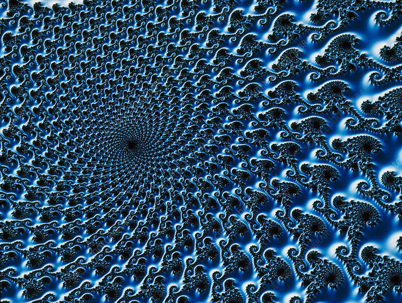
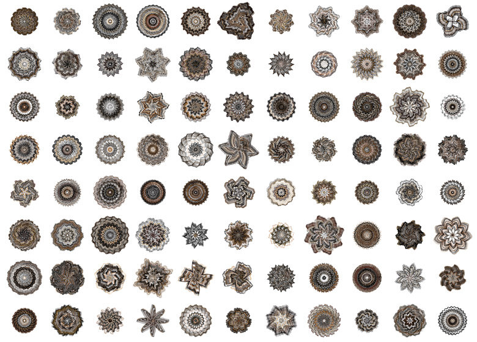
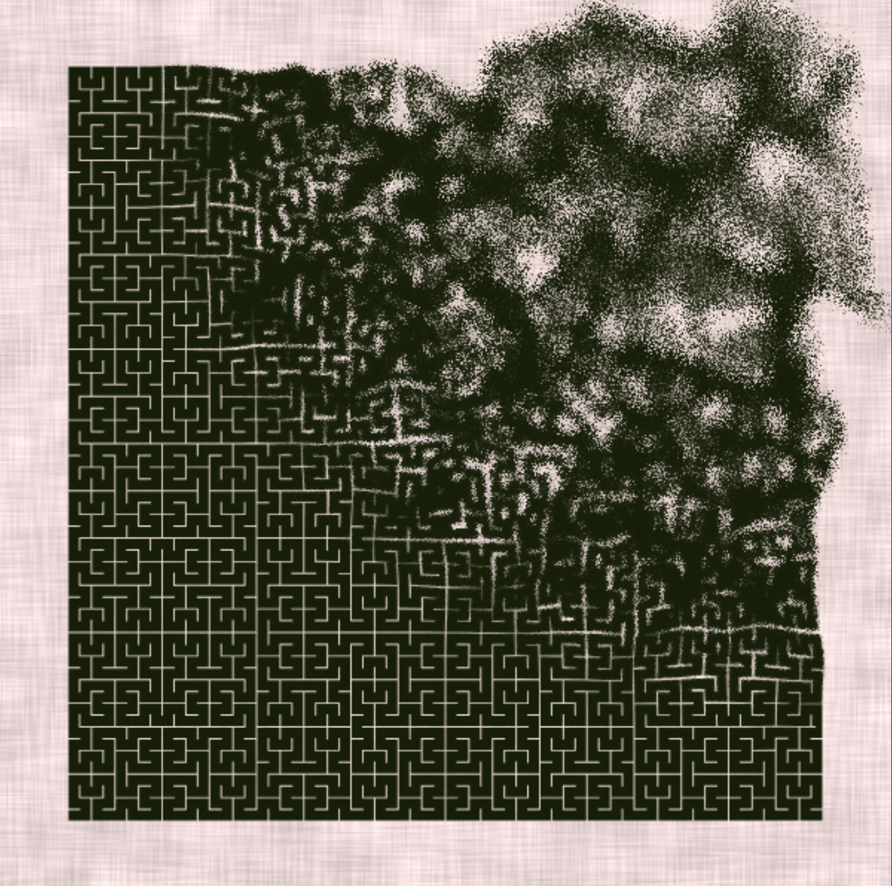

# cshe0449_9103_Week 8 Quiz 

## Part 1: Imaging Technique Inspiration

For my assignment, I find **generative art techniques**, particularly those involving **algorithmic patterns and fractals**, highly inspiring. The aspect I'd like to incorporate into my project is the concept of emergent complexity and self-similarity found in fractals like the Mandelbrot set. This technique offers a visually captivating way to represent intricate structures that evolve from simple rules, reflecting a sense of organic growth and complexity.

### Inspiration:
1. Fractal image of the Mandelbrot Set

2. Generative Art by Jared Tarbell

## Part 2: Coding Technique Exploration

To implement the imaging technique inspired by organic patterns in nature using p5.js, I would explore the use of Perlin noise, geometric shapes, colour blending, and animation. By leveraging p5.js's capabilities in drawing shapes, applying colours, and animating elements, I'm able capture the essence of the chosen artwork ["Wheels of furtune"](https://canvas.sydney.edu.au/courses/56592/files/35576064/preview) and create an interactive visualisation. One specific coding technique that could assist in achieving this effect is using classes to represent different layers of shapes and animating them to create a dynamic and layered composition. Additionally, [Perlin noise](https://openprocessing.org/sketch/2174234) can add organic randomness and texture to the artwork. 

